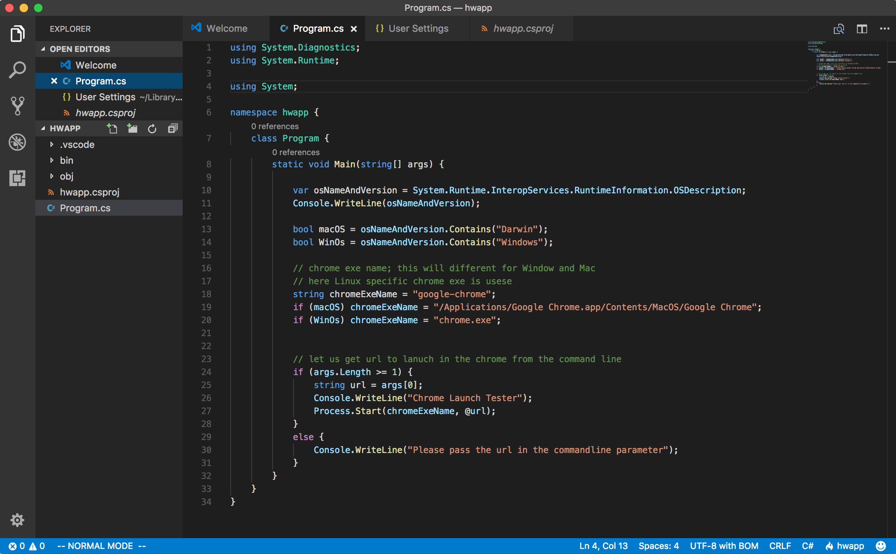

## Launching Chrome Browser Tabs in Ubuntu and macOS using dotnet #C code


### Demo


### DotNet version used 

``` 
$ dotnet --version
2.0.0

```

### How to create this app

```
$ dotnet new console -o hwapp

```

### Project file structure


### code for Program.cs

```c#


using System.Diagnostics;

namespace hwapp {
    class Program {
        static void Main(string[] args) {
            // chrome exe name; this will different for Window and Mac
            // here Linux specific chrome exe is usese
            string chromeExeName = "google-chrome"; 
            // let us get url to lanuch in the chrome from the command line
            if (args.Length >= 1) {
                string url = args[0];
                Console.WriteLine("Chrome Launch Tester");
                Process.Start(chromeExeName, @url);
            }
            else {
                Console.WriteLine("Please pass the url in the commandline parameter");
            }
        }
    }
}
```

### How to change it to other Operating Systems

- Change the variable ```chromeExeName``` to correct value

In case of Windows you can find this from the registry as:

```
Examples:

HKEY_LOCAL_MACHINE\SOFTWARE\Microsoft\Windows\CurrentVersion\App Paths\chrome.exe

Windows 7:  \Users\[you]\AppData\Local\Google\Chrome\Application\chrome.exe


```

### Sample

```C#

using System.Diagnostics;
using System.Runtime;

using System;

namespace hwapp {
    class Program {
        static void Main(string[] args) {
            
            var osNameAndVersion = System.Runtime.InteropServices.RuntimeInformation.OSDescription;
            Console.WriteLine(osNameAndVersion);

            bool macOS = osNameAndVersion.Contains("Darwin");
            bool WinOs = osNameAndVersion.Contains("Windows");
            
            // chrome exe name; this will different for Window and Mac
            // here Linux specific chrome exe is usese
            string chromeExeName = "google-chrome"; 
            if (macOS) chromeExeName = "/Applications/Google Chrome.app/Contents/MacOS/Google Chrome";
            if (WinOs) chromeExeName = "chrome.exe";
            

            // let us get url to lanuch in the chrome from the command line
            if (args.Length >= 1) {
                string url = args[0];
                Console.WriteLine("Chrome Launch Tester");
                Process.Start(chromeExeName, @url);
            }
            else {
                Console.WriteLine("Please pass the url in the commandline parameter");
            }
        }
    }
}

```

#### macOS

```bash
$ dotnet --version
2.0.0
~/dotnet/chrome:
$ uname -a
Darwin .... 16.7.0 Darwin Kernel Version 16.7.0: Thu Jun 15 17:36:27 PDT 2017; root:xnu-3789.70.16~2/RELEASE_X86_64 x86_64


```


#### Refenences

1. [dotnet core](https://www.microsoft.com/net/core#macos)
