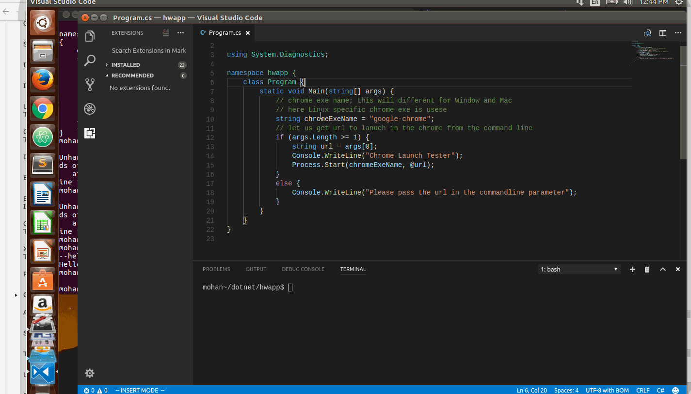
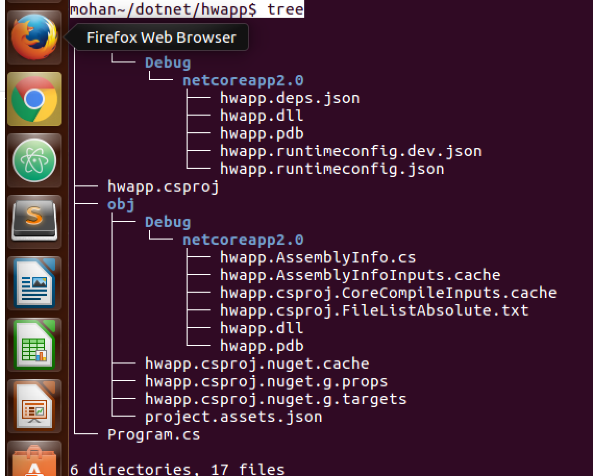

### Launching Chrome Browser Tabs in Ubuntu using dotnet #C code



### DotNet version used 

``` 
$ dotnet --version
2.0.0


### How to create this project

```bash

$ dotnet new conole -o hwapp


```

### Project file structure



```

### code for Program.cs

```c#


using System.Diagnostics;

namespace hwapp {
    class Program {
        static void Main(string[] args) {
            // chrome exe name; this will different for Window and Mac
            // here Linux specific chrome exe is usese
            string chromeExeName = "google-chrome"; 
            // let us get url to lanuch in the chrome from the command line
            if (args.Length >= 1) {
                string url = args[0];
                Console.WriteLine("Chrome Launch Tester");
                Process.Start(chromeExeName, @url);
            }
            else {
                Console.WriteLine("Please pass the url in the commandline parameter");
            }
        }
    }
}
```

### How to change it to other Operating Systems

- Change the variable chromeExeName to correct value
